# Pickling and Structured Error Handling

## Introduction
The goal of this assignment was to write a program that demonstrates the use of pickling methods and exception handling. A ***Menu*** class is used to display to the user the various examples in the application and gets input from the user for their choice.
1)	[Pickling] Append binary data to a file.
2)	[Pickling] Read and display data from binary file.
3)	[Error Handling] Basic try / except example.
4)	[Error Handling] Using try / except to capture and print the exception.
5)	[Error Handling] Using try / except to look for a specified exception.
6)	[Error Handling] Using raise to cause a custom exception.
7)	Exit program.

The two remaining classes, Pickling and ErrorHandling, contain the code to the various methods described in the menu.

## The Pickling Class
**AppendBinaryData() Function**

This function gets data in the form of an ***Item ID*** and ***Item Name*** from the user, then opens a file in append binary mode, then writes the data to the file using the ***pickle.dump()*** function.  (Figures 1 & 2)

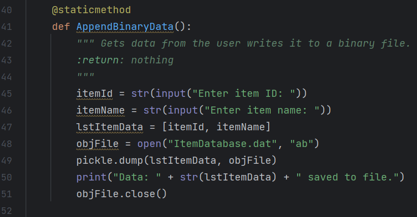

***Figure 1. Using pickle.dump() to write data to a binary file.***

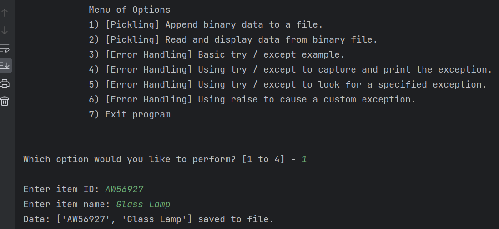

***Figure 2. Running the AppendBinaryData() function***

**ReadBinaryData() Function**

This function opens the data file in ***read binary*** mode, reads the data from the file using the ***pickle.load()*** function, then prints out the data in a formatted table.  It uses exception handling in two ways.  The first checks for an exception when opening the data file.  If it encounters one, then it informs the user to use menu item #1 to write out a data file first.  The second one reads data from the file in a loop until it encounters the ***EOFError*** exception to exit the loop. (Figures 3 & 4)

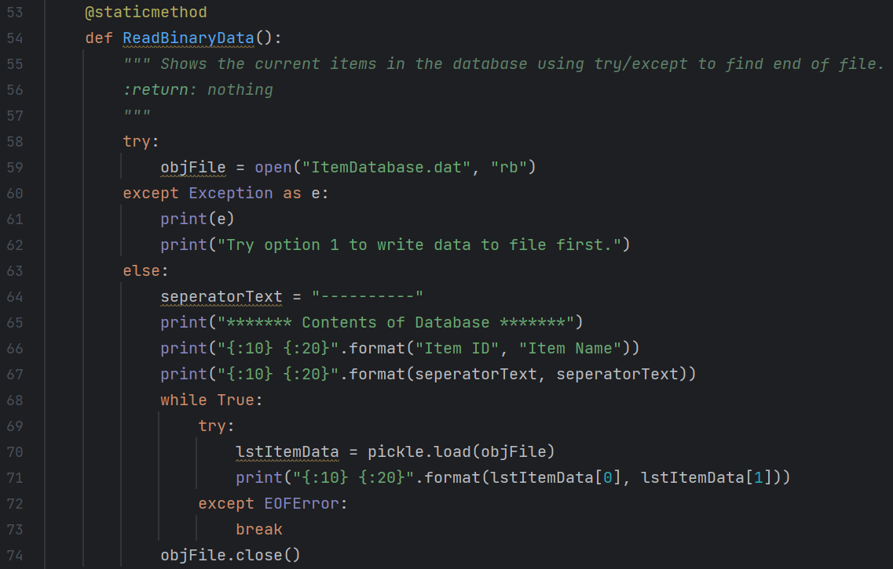

***Figure 3. Opening and reading data from the file using try / except to catch exceptions.***

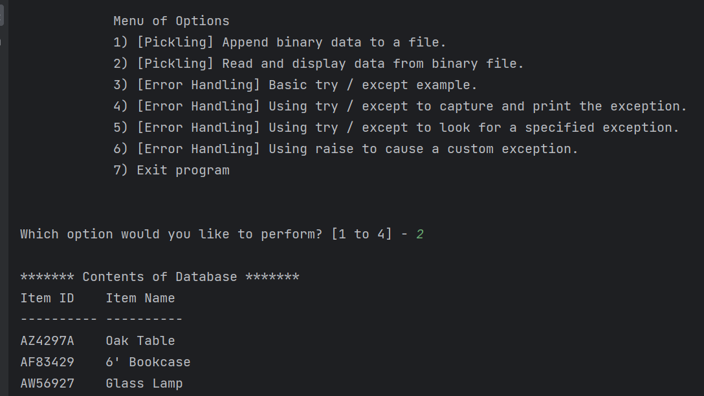

***Figure 4. Running the ReadBinaryData() Function.***

## The ErrorHandling Class
While (Figure 3) above shows some common ways to use exceptions in an application, the functions in this class demonstrate some other ways to use exceptions. 

**The BasicTryExcept() Function**

This function shows the basic use of ***try*** and ***except***. This is useful when you just want to protect the application against crashing. It’s especially useful when the application could encounter an error due to user input. This function also shows how you could continue a function after an exception using the ***finally:*** keyword.  Although this works, after researching this subject, it’s generally considered bad form to use the ***finally:*** keyword like this as you would usually want to just exit the function. (Figures 5 & 6)

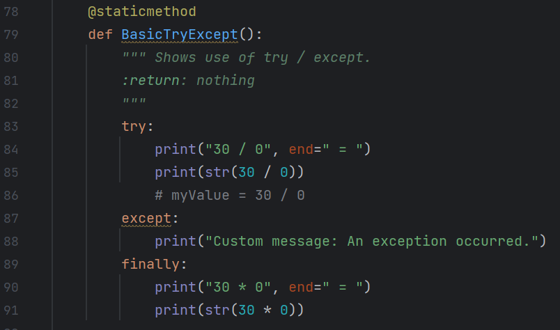

***Figure 5. Using the basic try and except keywords to catch an exception.***

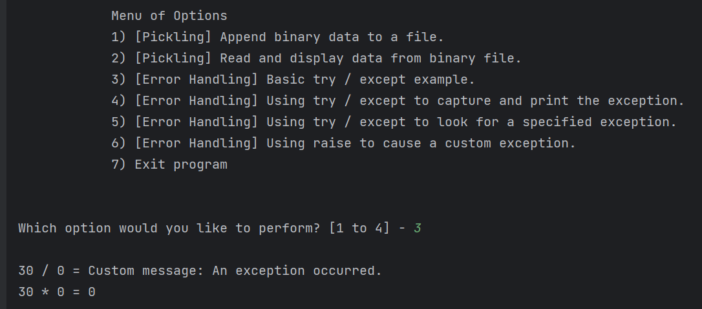

***Figure 6. Running the The BasicTryExcept() function.***

**The TryExceptCapture() Funtion**

In addition to wrapping the bad code in the ***try except*** block, it also puts the exception in a variable and prints out additional information about the exception by printing the exception, followed by the ***type()*** of exception, followed by more details on the exception. (Figures 7 & 8)

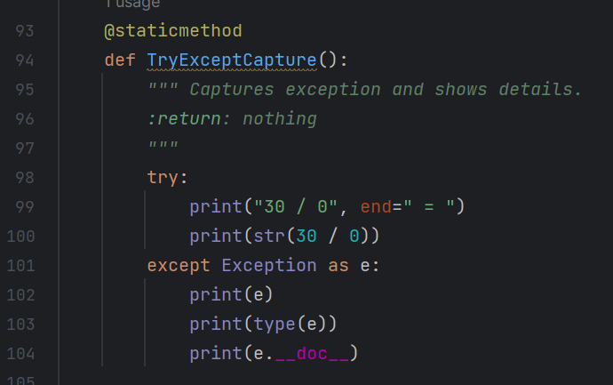

***Figure 7. Capturing the exception and printing out additional information about it.***

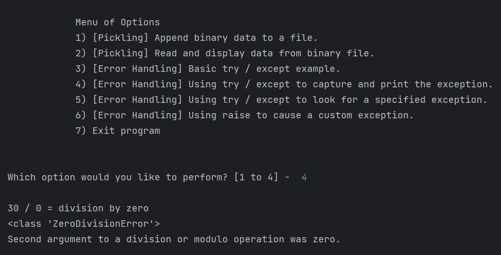

***Figure 8. Running the TryExceptCapture() function.***

**The TrySpecifiedException() Funtion**

This function shows how to look for a specific exception and then an additional handler for any other exception. (Figure 9 & 10)

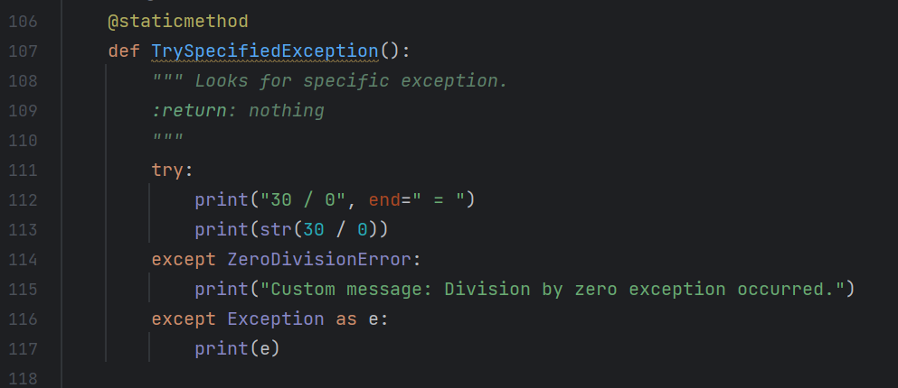

***Figure 9. Catching a specific exception.***

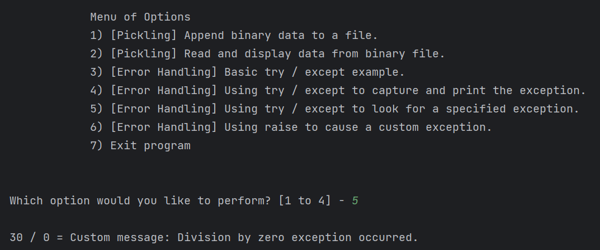

***Figure 10. Running the TrySpecifiedException() function.***

**The RaiseExample() Funtion**

This function shows how to create a custom exception using the ***raise*** keyword. In this example, it looks for negative numbers. (Figures 11 & 12)

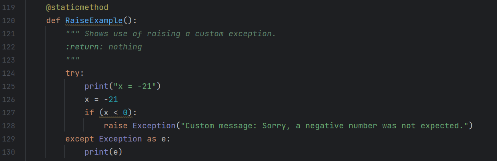

***Figure 11. Creating a custom exception using the raise keyword.***

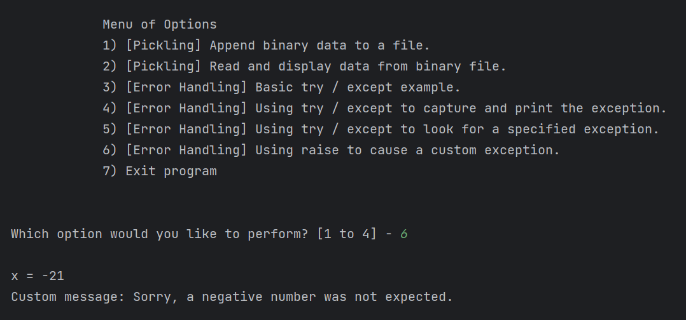

***Figure 12. Running the RaiseExample() function.***

**Running the Application from the Command Line**

Finally, running one of the application functions from the command line. (Figure 13)

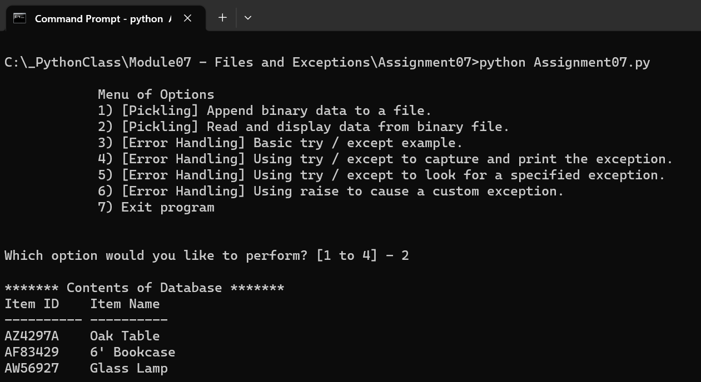

***Figure 13. Running the application from the command line.***

## Summary
The goal of this assignment was to explore the use of ***Pickling*** functions as well as using exception handlers in various ways. The Pickling functions were used to write and read data to and from a binary file. The ***ErrorHandling*** class showed different ways to use the ***try*** and ***except*** keywords in code to capture exception instead of letting the application crash.

